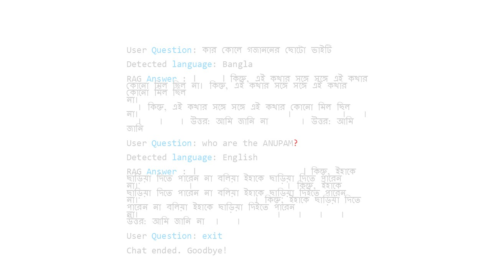

# Multilingual Retrieval- Augmented Generation (RAG) System

Design and implement a basic RAG pipeline capable of understanding and responding to 
both English and Bengal queries. The system should fetch relevant information a pdf 
document corpus and generate a meaningful answer ground in retrieved content.

### File Structure
    multilingual_rag_system/
    │
    ├── faiss_index                 # saved the indexing embedded to FAISS INDEX folder for vector store
    ├── main.py                     # FastAPI app 
    ├── RAG.py                      # RAG core logic
    ├── clean_text4.txt             # OCR output
    ├── HSC26-Bangla1st-Paper.pdf   # Given PDF 
    ├── bonus_task.py               # for build REST API and tried RAG Evaluation
    ├── .env                        # Environment variables
    └── requirements.txt            # Dependencies

## Setup Guide

#Create virtual environment (i used Python 3.12)
python -m venv venv

venv\Scripts\activate  # On Windows

#Install dependencies

pip install -r requirements.txt

## Tools and library used


| Tool       | purpose               |           
|------------------------|---------------------------------------------------------|
| pytesseract, pdf2image | OCR for Bangla PDF to extrect without formatting issue       |    
| langchain, FAISS       | RAG components and vector DB  | 
| transformers           | Pretrained LLM (M-T5)"     |
| HuggingFaceEmbeddings  | Multilingual semantic embedding  |
|dotenv                  |  Environment variable management  |                

## Deployment

AT first i work done bellow instraction

- Text extract from PDF (using OCR ,pytesseract, pdf2image to avoid formating issue)
- Preprocess the data (here i have taken 5-19 page text for relevent query from PDF and removed newline and empty espace )
- Chunk the data 
- formatted chunk query or passag and prefix for multilingual-e5-base model
- Embedding the chunk (using HuggingFaceEmbeddings and model multilingual-e5-base )
- indexing for Vector store (using FAISS)
- Retrieved (search_type "similarity" and K=6 to get six similarit context)
- pipeline for model building
- build prompt using PromptTemplate
- build RAG chain and creat short time memory to stor chat history


## Running Tests(Sample queries and outputs (Bangla & English) )

To run tests, run the following command

```bash
  python RAG.py
```
Output the RAG.py
  
  

## Fast API documentation
i have implemnted REST API for Simple conversation using fast API.

this API Endpoint should accept user input and return model-generated responses.

[main.py](https://linktodocumentation)  and 
[bonus_task.py](https://linktodocumentation)

for API run this command
```bash
  uvicorn main:app --reload
```
http://loaclhost/query for post method 

{
  "user_input": "কার কোলে গজাননের ছোটো ভাইটি?"}
## Evaluation Matrix

tried evaluation for my build in RAG [bonus_task.py](https://linktodocumentation)
```bash
  python bonus_task.py
```


## Lessons Learned

- What method or library did you use to extract the text, and why? Did you face any formatting challenges with the PDF content?

  Library/Method Used:

  pytesseract (OCR) + pdf2image

  #### Why this method?

  The source PDF [HSC26-Bangla1st-Paper.pd](HSC26-Bangla1st-Paper.pdf) uses complex Bangla fonts that are not Unicode-compliant. Standard PDF extractors like PyPDFLoader or PyMuPDF fail to extract meaningful Bangla text due to encoding issues. So

  To overcome this, I used OCR (Optical Character Recognition):

   pdf2image:  Converts PDF pages into high-resolution images.

  pytesseract: Performs OCR on images using the Bangla (ben) language pack.

  Challenges faced:

  OCR sometimes introduces spacing or punctuation issues.

  Sentences may be broken across lines or merged incorrectly.

  Required post-processing (e.g., removing line breaks, normalizing whitespace).

  Why it still works:

  Despite minor formatting noise, the semantic meaning of the content is largely preserved  after cleanup. This made it usable for embedding and retrieval.

- What chunking strategy did you choose (e.g. paragraph-based, 
  sentence-based, character limit)? Why do you think it works well for 
  semantic retrieval?

  I Strategy Used:

  RecursiveCharacterTextSplitter with:

  chunk_size=1000

  chunk_overlap=200

  Custom separators: ["।", "\n"] to respect Bangla sentence boundaries

  Why this works well:

  Since Given the PDF, Sentences in Bangla often carry meaningful semantic units, especially in educational texts.

  By using sentence boundaries (।) and overlaps, I ensure:

  Each chunk has context from the previous part.

  Short chunks are avoided (e.g., one-word fragments).

  Long chunks are not truncated mid-idea.

  Effectiveness:

  Helps FAISS better understand and match the context.

  Reduces irrelevant retrieval and improves grounding of answers.

- What embedding model did you use? Why did you choose it? How does it capture the meaning of the text?

  For Embedding, Model Used:

  "intfloat/multilingual-e5-base"


  Why this model:

  Multilingual support: Handles both Bangla and English queries.

  Efficient and lightweight: Suitable for academic and small-scale use.

  Trained for semantic similarity tasks (e.g., sentence-level matching).

  i was also used  "sentence-transformers/paraphrase-multilingual-MiniLM-L12-v2" but didn't better result for my RAG.

  How it captures meaning:

  The model converts each chunk and user query into high-dimensional vectors.

  These vectors encode semantic relationships, not just keywords — e.g., it can understand that “ভাই” and “ছোট ভাই” are related in context.

- How are you comparing the query with your stored chunks? Why did you choose this similarity method and storage setup?

  Comparison Method:

  Cosine similarity between embedding vectors.

  Implemented using FAISS vector store.

  Why this setup:

  FAISS is fast, scalable, and optimized for nearest-neighbor search on dense vectors.

  Cosine similarity measures how "directionally similar" two vectors are — ideal for semantic tasks.

  Result:

  The top-k chunks retrieved are semantically closest to the user's query, even if the wording is slightly different.

- How do you ensure that the question and the document chunks are 
  compared meaningfully? What would happen if the query is vague or 
  missing context? 

  Ensuring meaningful comparison:

  Clean preprocessed chunks (after OCR and sentence-aware splitting)

  Multilingual semantic embeddings ensure that both Bangla and English queries map to the  same semantic space.

  Prompt design for FLAN-T5 ensures that:

  The generation step only uses retrieved context.

  when no answer is found then The model replies “আমি জানি না।” .

  What if the query is vague or unclear?

  Retriever will still return semantically similar chunks.

  If no relevant context is found, FLAN-T5 will generate a fallback response (e.g., “আমি জানি না।”).

  This avoids hallucinated or misleading answers.

- Do the result seem relevant? If not , what might improve them (e.g. 
  better chunking , better embedding model, larger document)?

  Results observed:

  Most Bangla queries return No relevant and grounded answers.

  Contextual answers like “অন্নপূর্ণার কোলে কার ছোট ভাই?” worked Not accurately.But in retriever invoked this query and gives six similarity context (as search_kwargs={"k": 6}) and there has my queryeses answers that i saw by debugging.

  AND Vague or overly broad questions are harder to answer correctly — expected behavior.

  What can improve it:

  Better OCR cleanup:

  Fix punctuation issues

  Normalize strange spacing

  Switch embedding model to a Bangla-specific model.Or use Bangla-tuned generation model.I hope that this model if i do fine-tuned by custom data and then use for this RAG system wiil get better Answer. 

  Use larger document corpus: More pages, more context for rare topics

  Fine-tune chunk size: Some topics may benefit from smaller/larger chunks depending on style of writing